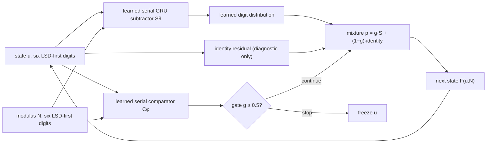

# Research handoff — serial learned modular reducer

**Repository:** `EyimofeA/one-somn-deeper`
**Branch at handoff:** `main`
**Latest relevant commits:** `ca5f943`, `1d4c1f6`, `5238aea`
**Date:** 2026-08-04
**Status:** controlled mechanism work is promising; no new competition submission is ready.

This document reconstructs the current research branch for an agent that did
not see the preceding conversation. It is a navigation document, not a
replacement for the evidence. Treat [`solving/RESEARCH_LOG.md`](solving/RESEARCH_LOG.md),
[`solving/experiments/predictions.md`](solving/experiments/predictions.md), and
the cited JSON artifacts as source of truth.

## 1. Objective and constraints

The competition task is repeated modular squaring. Given a composite modulus
`N`, base `x`, and depth `T`, the submitted model must predict

\[
x_0=x\bmod N,\qquad x_t=x_{t-1}^2\bmod N,\qquad y=x^{2^T}\bmod N.
\]

The prompt is tokenized `N, digits(N), X, digits(x), T, digits(T)` and every
output digit must be correct. Hard ranking is certified consecutive depth,
then unseen-modulus depth, not mean accuracy. Read
[`learnings/concepts/01-the-problem.md`](learnings/concepts/01-the-problem.md)
and the current upstream rule audit in
[`solving/STATUS.md`](solving/STATUS.md) before changing submission code.

This handoff concerns a deliberately smaller diagnostic: learn a reusable,
unseen-modulus decimal reduction primitive

\[
F(u,N)=\begin{cases}u-N,&u\ge N\\u,&u<N.\end{cases}
\]

for synthetic states `u=qN+r`, `0≤r<N`. This is necessary for a learned
modular-squaring solution but does **not** solve squaring or the competition.

### Non-negotiable competition boundaries

- Never use factorization, `φ(N)`, closed-form modular exponentiation, `%` on
  task values, dataset inspection, augmentation, or a hard-coded solver in a
  submission. See [`RESEARCH_PROTOCOL.md`](RESEARCH_PROTOCOL.md) §6.
- Never turn a diagnostic data generator or reference computation into a
  submission shortcut. Arithmetic is used only to construct synthetic labels
  in this research harness; it is not present in learned module forwards.
- The current `ComparatorReducer` contains an exact input identity residual.
  Its own source labels it **diagnostic-only / never a submission path**. Do
  not submit it unchanged without a fresh rule audit and a legal architecture
  review.
- Before every training run, append a one-variable `CARD/CHANGE/PREDICT` to
  [`solving/experiments/predictions.md`](solving/experiments/predictions.md);
  append `RESULT` after. Preserve large checkpoints and metrics outside Git.

## 2. Current best controlled architecture

### Representation and split

- Decimal states and moduli are zero-padded to `WIDTH = 6` digits.
- Digits are reversed before entering the model: **least-significant digit
  first (LSD→MSD)**. Position 0 is the units digit. This lets the shared GRU
  propagate a learned borrow-like state toward more significant digits.
- The deterministic seed-0 modulus pool consists of 64 four-digit semiprimes
  made from primes 31–99. The first 48 are seen in training; the remaining 16
  are held-out moduli. Each quotient bucket uses 128 independent sampled
  remainders/modulus: 6,144 train examples or 2,048 held-out examples per `q`.
- The q≤100 support run contains q=0 identity plus q=1…100 subtraction
  transitions: 620,544 training rows before cycling batches.

### Components

`diagnostics/train_serial_subtractor.py` defines `SerialSubtractor`:

1. learned digit embedding `E_d` and learned place embedding `E_p`;
2. at each aligned LSD-relative place `i`, concatenate embedded state and
   modulus digits, map through `tanh(pair(...))`;
3. advance one shared `GRUCell` state;
4. map each per-place hidden state to ten learned digit logits.

`diagnostics/train_comparator_reducer.py` adds `SerialComparator`, the same
LSD-first embedding/pair/GRU pattern with one scalar output. It predicts
`g=C_φ(u,N)≈P(u≥N)`.

Let `S_θ(u,N)_i` be subtractor logits at digit position `i`, and `e(u_i)` the
one-hot current input digit. The diagnostic composition is

\[
p_i = g\,\operatorname{softmax}(S_θ(u,N)_i) + (1-g)e(u_i),\qquad
F(u,N)_i=\arg\max_d p_i[d].
\]

At autonomous inference, `g≥0.5` means continue and update with `F`; `g<0.5`
means freeze the current state. It receives neither `q`, a remaining-step
counter, nor an oracle stopping depth.



The intended recurrent dynamical system is therefore

\[
u_0=qN+r,\qquad u_{t+1}=F(u_t,N),\qquad
\text{halt when }C_φ(u_t,N)<0.5.
\]

The fixed-point requirement is essential: `F(r,N)=r`. Without it, a
canonicality/stop head can correctly identify a remainder yet the transition
still corrupts it on the next step.

### Reproduction pointers

- architecture/train driver:
  [`diagnostics/train_comparator_reducer.py`](diagnostics/train_comparator_reducer.py)
- serial subtractor/data split:
  [`diagnostics/train_serial_subtractor.py`](diagnostics/train_serial_subtractor.py)
- frozen teacher-transition versus rollout audit:
  [`diagnostics/audit_comparator_transition_rollout.py`](diagnostics/audit_comparator_transition_rollout.py)
- local, uncommitted artifacts for this exact branch:
  `diagnostics/artifacts/somn-l40-2026-08-04/serial_comparator_controlled_reducer_seed0/`

The final checkpoint is intentionally excluded from Git at:

```
diagnostics/artifacts/somn-l40-2026-08-04/
  serial_comparator_controlled_reducer_seed0/stage3_q100/reducer.pt
```

The remote run was under `oneL40:~/somn-taskb/runs/serial_comparator_controlled_reducer/seed0/stage3_q100/` when this handoff was written. Verify it exists; do not assume a remote instance persists.

## 3. Timeline of today’s relevant experiments

| Branch | Hypothesis / implementation | Measured result | Decision |
|---|---|---|---|
| Serial q=1 subtractor | LSD-first learned digit GRU can learn `N+r→r` across moduli. | 100% held-out-N q=1 exact, all output digit positions exact. | Accepted: decimal significance plus serial information flow matters. |
| Multi-step subtraction | Train transitions q=1…5, then q=1…10; apply the same subtractor repeatedly. | q=1…5 support and then q=1…10 support made long prescribed-depth rollout strong; a q=1-only model lacked raw high-q transition support. | Accepted: tied recurrence can compose, but trace-state distribution matters. |
| Width-six audit | Earlier width-five representation could not represent some q=10 states. Change only width 5→6. | No truncation q=1…10; seed-0 autonomous q=1…10 was 100%. | Accepted: prior seed-2 result was a deterministic width confound, not arithmetic failure. |
| Learned canonicality head | Freeze subtractor; learn stop from `(state,N)` with q=0…5 trace states. | q=0…7 autonomous exact/halt 100%; failures q=8…10 matched first unsupported subtractor transition. Stop classification itself had zero ordinary false positives/negatives. | Accepted as a diagnostic: stopping is not the first blocker. |
| Stability-gated halt | Stop only if canonical and another transition leaves state unchanged. | Refuted: for q=1…10 subtractor, `F(r,N) != r` on all 2,048 held-out remainders. | Rejected: current subtractor did not encode remainders as fixed points. |
| Identity/recovery augmentation | Add q=0 `r→r` labels and generated wrong-canonical recovery labels to monolithic subtractor. | Refuted: fixed points stayed 0%; q-transition quality fell sharply. | Do not repeat or scale this data mixture. |
| Clean monolithic piecewise map | Balance q=0 identity and q=1…20 subtraction in the same serial GRU. | q=0 fixed-point exact 0% even on seen remainders; q=1/5/10 transitions 100%, q=20 96.44%. | Rejected: a monolithic GRU does not fit this branch condition at the given training regime. |
| Learned comparator | Separate a serial learned classifier for `u≥N`; include N−1/N/N+1 examples. | 100% seen-N, 99.9279% held-out-N (4,160 examples), 100% held-out boundary cases (64). | Accepted: comparison is learnable in the same LSD-first representation. |
| Comparator + subtractor | Gate learned subtractor probabilities against diagnostic identity residual; jointly train q=0…20. | 100% fixed points and autonomous exact halt q=0…28; q=29 first degradation, q=100 37.50%. | Accepted as the best controlled mechanism; comparator solves the missing branch. |
| Frozen transition-vs-rollout | Evaluate q=1,5,10,20,30,50,100 with checkpoint frozen. | Comparator 100% everywhere. One-step/composed: 100% through q=20, 93.75% q=30, 85.06% q=50, 86.04% q=100. Rollout: 93.75%, 62.50%, 37.50% at q=30/50/100. | High-q primitive support fails first; rollout accumulation is secondary. |
| q=0…100 curriculum | Resume q≤20 comparator-reducer; change only balanced transition support to q=0…100, retain 4,000 updates, batch 512, optimizer family, width, split. | 100% on all 206,848 held-out q=0…100 transitions; 100% gate labels, fixed points, autonomous remainder, exact halt; no early/late/non-stops. | Accepted: full intermediate-state support removes the q≈30 frontier in-range. |
| Frozen horizon probe | No training; test q=101,110,120,130,140. | 100% comparator, raw subtractor, composed one-step, and autonomous exact in every bucket (2,048 each). | Accepted as bounded 40% quotient-depth extrapolation. q≥145 is not cleanly testable for all held-out moduli at width six. |

The full chronological evidence and exact metrics are in
[`solving/RESEARCH_LOG.md`](solving/RESEARCH_LOG.md), especially its final four
entries. Card predictions and post-hoc classifications are in
[`solving/experiments/predictions.md`](solving/experiments/predictions.md).

## 4. Current frontier

### What is established by the newest artifacts

| Evaluation | Result | Evidence |
|---|---:|---|
| Held-out-N comparator, boundary N−1/N/N+1 | 99.9279% overall; 100% boundary | `stage1/eval_report.json` |
| q≤20 checkpoint, raw one-step q=30 / q=50 / q=100 | 93.75% / 85.06% / 86.04% | `audits/transition_vs_rollout.json` |
| q≤20 checkpoint, rollout q=30 / q=50 / q=100 | 93.75% / 62.50% / 37.50% | same audit |
| q≤100 curriculum, q=0…100 | 100% transition, fixed point, halt, and rollout | `stage3_q100/eval_report.json` |
| q≤100 checkpoint, q=101…140 | 100% one-step and rollout per tested q | `stage3_q100/q101_140_horizon_probe.json` |

### Solved in the controlled harness

1. A fully learned serial subtractor generalizes q=1 to held-out moduli.
2. A learned serial comparator generalizes the `u≥N` decision, including
   boundaries.
3. Their diagnostic gated composition has stable canonical fixed points and
   autonomous halting.
4. With trace support through q=100, the composed learned reducer executes
   perfectly through q=140 in the common representable state range.

### Not solved

- A legal competition model integrating this mechanism into the tokenized
  prompt architecture.
- A learned squaring primitive. Earlier digit-product/carry gates are in
  `solving/STATUS.md`; do not infer that reduction solves multiplication.
- Generalization to the actual competition distribution of `N`, `x`, and `T`.
- All-example depth beyond q=144: six digits cannot encode q≥145 for every
  held-out four-digit modulus.
- Generalization across wider modulus digit lengths, seed stability, and
  retraining from scratch with a widened state representation.
- Any valid Easy, Medium, or Hard score improvement. Current best Hard result
  remains 0.0467% mean exact with no certified T=1 rung; this reducer is not a
  submission.

## 5. Ranked remaining hypotheses

Follow the prediction rule and use one card per item. Do not silently combine
these changes.

1. **Width is now the measurement blocker.** Change only state width from six
   to seven digits, retain the comparator/subtractor design, q=0…100 support,
   split, optimizer, batch size, and update count. Re-train (the old checkpoint
   cannot simply be loaded because of position embeddings) and test a fully
   representable q=101…500 range. Prediction: if the learned primitive is
   reusable, the old q≤100/q≤140 behavior reappears at the wider range; failure
   could instead identify a width-dependent optimization issue.

2. **Map the extrapolation frontier only after the width control.** With a
   fixed widened checkpoint, report teacher-forced and autonomous curves by q,
   plus the first q below 100%, 95%, and zero exact. This distinguishes local
   transition support from recurrence accumulation without changing the model.

3. **Modulus-range generalization.** Once a width-safe depth result exists,
   train/evaluate disjoint modulus ranges or digit lengths while retaining the
   same serial architecture. q=1 must be reported separately. This tells us
   whether the learned subtraction law is truly compositional rather than
   restricted to the current 4-digit semiprime family.

4. **Only then: legal integration design.** Audit whether a prompt-model
   version can obtain learned copy/identity behavior without the diagnostic
   hard residual, while preserving the exact competition constraints. Build a
   submission candidate only after the rules and data interface have been read
   again. This is a design and legality problem, not an invitation to restart
   generic architecture search.

5. **Squaring composition.** The reducer has not solved digit multiplication.
   Resume the existing product/carry gate only after the reduction primitive is
   width- and modulus-tested. Any proposal must explain how its output state is
   fed to the reducer without handwritten arithmetic.

## 6. Submission strategy (draft, not authorization)

The current evidence suggests a future model should learn two reusable
operations from competition examples:

\[
\text{square state} \longrightarrow \text{serial comparison/reduction loop}
\longrightarrow \text{canonical remainder}.
\]

A candidate would use LSD-relative digit features, tied serial recurrent
cells, a learned comparison/continue head, and learned output digit heads. It
would be trained on full intermediate traces covering the state distribution
it will revisit during rollout. It would receive only the official tokenized
prompt and use no `q`, factorization, oracle depth, or handwritten arithmetic
at inference.

**Expected strength:** the controlled results show a learned serial state can
transfer subtraction and comparison to unseen moduli, maintain fixed points,
halt autonomously, and execute far beyond its observed q range when trained on
the relevant intermediate-state distribution.

**Primary risks:**

- The current exact identity residual is diagnostic and may violate the spirit
  or letter of a legal learned submission; it must not be copied blindly.
- The competition asks for squaring plus reduction, while this branch covers
  only reduction labels constructed offline.
- Competition input/output format, N range, state width, time/memory ceiling,
  and one-forward/one-backward restrictions can invalidate an otherwise good
  diagnostic.
- Perfect seed-0 synthetic results are not a substitute for three-seed or
  official-tier evidence.

Before any submission: inspect the pinned/current rules, run the pre-submit
ban grep, check all state-element and runtime limits, train solely from the
official permitted data path, and preserve a complete rationale beside the
candidate. Do not auto-submit Hard.

## 7. Instructions to the next agent

### First reads and checks

1. Read `AGENTS.md`, `PITFALLS.md`, `RESEARCH_PROTOCOL.md`, then
   [`solving/STATUS.md`](solving/STATUS.md).
2. Read the final entries of [`solving/RESEARCH_LOG.md`](solving/RESEARCH_LOG.md)
   and the matching cards in `solving/experiments/predictions.md`.
3. Inspect commits `ca5f943`, `1d4c1f6`, and `5238aea`; then inspect the three
   diagnostic scripts named above.
4. Verify artifact availability and load their JSON reports before claiming a
   result. Checkpoints are deliberately untracked and remote storage may be
   ephemeral.
5. Re-read the upstream rule audit before writing anything under
   `solving/submissions/`.

### Do not do these things

- Do not restart generic Transformer, workspace, Abacus, or architecture
  search while this serial-reducer mechanism has clear unresolved controls.
- Do not repeat width-five, monolithic q=0 identity, identity/recovery-label,
  or stability-gated-halting experiments as though they are open hypotheses.
  They are recorded refutations above.
- Do not call q≤100 perfection unlimited algorithmic generalization.
- Do not misread an evaluation cap or a width overflow as a model failure.
  The q≥120 false alarm was exactly such an audit-cap bug; the current audit
  defaults its cap to `max(requested_q)+10`.
- Do not commit checkpoints, generated data, raw metrics, or unrelated existing
  untracked files. Do not delete remote GPU state unless explicitly asked.
- Do not turn the diagnostic residual or synthetic label-generation arithmetic
  into a submission shortcut.

### Do these things

- Preserve the LSD-first alignment, unseen-modulus split, and separate
  teacher-forced versus autonomous metrics unless a registered card changes
  one of them.
- Start the width-seven control as the highest-priority next experiment, with
  an explicit representability audit and exact q/N buckets.
- Report per-q: comparator accuracy, raw subtractor next-state exactness,
  composed transition exactness, final remainder exactness, exact stop step,
  early/late/non-stop counts, and number of representable examples.
- Classify every outcome: support for an in-range mechanism, bounded
  extrapolation, representation failure, or genuine arithmetic failure. Keep
  these categories separate.
- Once width is resolved, evaluate the actual required q/N range before
  proposing a submission. Only then audit a legal prompt-model integration.

## Commit map

| Commit | Meaning |
|---|---|
| `b8f5c38` | serial unseen-N subtractor promoted after q=1 result |
| `cb4d92c` | width-six serial subtractor audit |
| `fe99773` | learned canonicality/halting diagnostic |
| `7e7622f` | q=1…10 subtractor transition support |
| `3f8e086` | stability/absorbing-state test (refuted) |
| `38f90c7` | monolithic piecewise identity/subtraction test (refuted) |
| `ca5f943` | learned comparator-controlled reducer |
| `1d4c1f6` | transition-vs-rollout diagnostic and q≤100 curriculum |
| `5238aea` | corrected horizon audit and q=101…140 result |

For older branches, use `git log -- <path>` rather than reconstructing history
from prose. The repository’s global status and historical competition work are
kept in [`solving/STATUS.md`](solving/STATUS.md); this file intentionally
focuses on the active serial-reduction trajectory.
