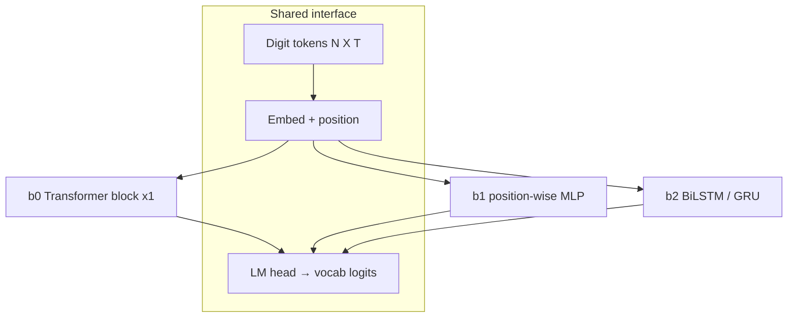

# Architectures, inductive bias, and the train loop

## How training actually works (optimizer side)

You do **not** write the training loop. The evaluator does roughly:

```text
for step until time budget:
    batch = sample(train)
    logits, aux = model(input_ids, attention_mask)
    loss = default_or_custom(logits, labels, aux)
    loss.backward()
    clip_grad_(max_norm=1.0)          # fixed by evaluator
    optimizer.step()
    scheduler.step()                  # if you returned one
    optimizer.zero_grad()
```

Your `build_optimizer` returns an `OptimizerBundle` whose optimizer must cover **every trainable parameter exactly once**. Baseline uses AdamW(lr=1e−3, β=(0.9, 0.95), weight_decay=0.1).

**Depth–time tradeoff:** deeper forward → fewer `optimizer.step` calls before the clock dies. Easy = 60s H100. That is why tiny models with more loops can beat huge models that barely take steps.

## Three baselines — inductive bias (Phase 1)



| Model | Inductive bias | What it “believes” |
|-------|----------------|--------------------|
| **b0 Transformer** | Content-based mixing over the whole prompt | Relations between digit positions matter; one pass of mixing may be enough for tiny T |
| **b1 MLP** | Same MLP at every position; no attention | Local embed→feature map; weak at binding distant N and x digits |
| **b2 RNN** | Left–right (and bi) state | Serial scan of the token string — *not* the same as serial modular squaring depth, but closer to “state evolves” |

## Depth models (Phase 2) — the actual thesis


| Model | Bias |
|-------|------|
| **depth_looped** | Same transform iterated → algorithm-like depth; can spend more compute without more params |
| **depth_stable** | Identity-biased gates / LayerScale → survive large K without collapse |
| **depth_act** | Halt when “done” → adaptive compute per example |

## Which sees more gain? (hypothesis — measure, don’t trust)

**My prior (to falsify with Easy e1 / e5):**

1. **On Easy e1** (fixed N=323, T∈{1,2,3}): b0 Transformer likely beats b1 MLP. b2 RNN is the interesting underdog — sequential bias might help token structure but often underperforms Transformers on short bidirectional prompts. Absolute accuracies may all be low; we care about **ordering** and OOD gaps.
2. **On depth OOD** (larger T than train): **looped Transformer** should beat single-pass b0 if anything does — that is the competition’s intended axis. Untied deep stacks waste the 500M budget without the right bias.
3. **Biggest expected swing** after baselines: **b0 → depth_looped**, not MLP↔Transformer, *if* training still gets enough steps under the clock.

Reject until plotted: any claim without an Easy metric in `RESEARCH_LOG.md`.
