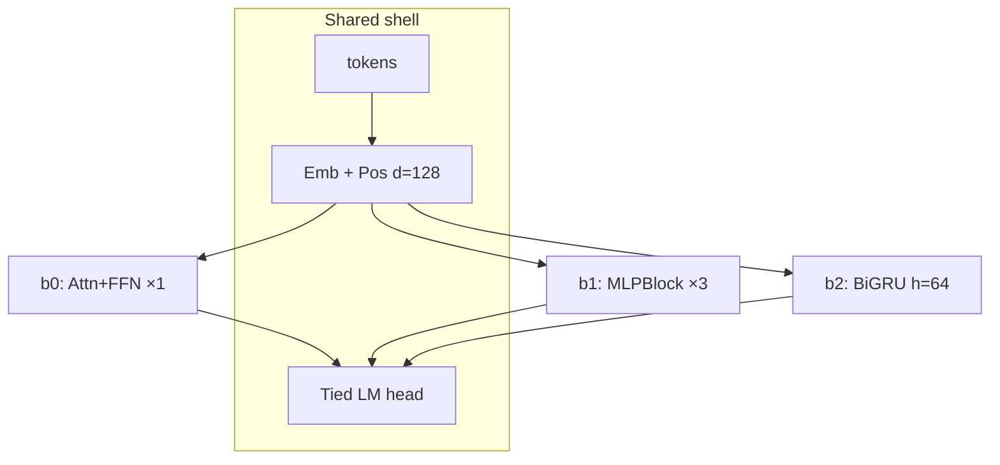

# Baseline architectures (paper-style)

All share: digit token embed + absolute position → body → RMSNorm → tied LM head.  
Optimizer (all): AdamW lr=1e−3, β=(0.9, 0.95), wd=0.1.  
d_model = 128 unless noted.

---

## b0 — Single-block Transformer (reference)

Like a 1-layer Pre-LN Transformer encoder (Vaswani-style attention + FFN), width 128, 4 heads. Official `baseline_adamw` fork.

```text
 input_ids
     │
     ▼
┌─────────────┐
│ Token Emb   │  E ∈ R^{V×128}
│ + Pos Emb   │  P ∈ R^{L×128}
└──────┬──────┘
       │  X ∈ R^{B×L×128}
       ▼
┌──────────────────────────────────────┐
│  Block × 1                           │
│  ┌────────────────────────────────┐  │
│  │ RMSNorm → QKV (4 heads)        │  │
│  │ SDPA (padding mask) → Out      │  │
│  │ residual                       │  │
│  │ RMSNorm → Linear↑4× → GELU     │  │
│  │ → Linear↓ → residual           │  │
│  └────────────────────────────────┘  │
└──────────────┬───────────────────────┘
               ▼
          RMSNorm → Tied LM Head → logits
```

**Inductive bias:** content-based mixing over the full prompt in one shot.

**Path:** `solving/submissions/b0_transformer/submission.py`

---

## b1 — Position-wise MLP stack (no attention)

Transformer FFN tower without attention — related to “attention-free” / channel-mixing ablations (e.g. MLP-Mixer *channel* path only, applied per token).

```text
 input_ids → Emb+Pos → X
     │
     ▼
┌─────────────────────────────┐
│  MLPBlock × 3 (shared? No — │
│  three independent blocks)  │
│  each:                      │
│    RMSNorm → ↑4× → GELU → ↓ │
│    + residual               │
│  (no token–token mixing)    │
└──────────────┬──────────────┘
               ▼
          RMSNorm → Tied Head
```

**Inductive bias:** each position transforms alone; digits of N cannot attend to digits of x except via the shared head/positions.

**Path:** `solving/submissions/b1_mlp/submission.py`

---

## b2 — Bidirectional GRU

Classic BiRNN encoder (Schuster & Paliwal; seq2seq encoder style) with pack-padded sequences.

```text
 input_ids → Emb+Pos → X
     │
     ▼
┌─────────────────────────────────────┐
│  pack_padded (mask lengths)         │
│  BiGRU: 1 layer, h=64 each way      │
│  → concat [fwd ‖ bwd] ∈ R^{128}     │
│  Linear 128→128                     │
│  RMSNorm; zero PAD positions        │
└──────────────┬──────────────────────┘
               ▼
          Tied LM Head → logits
```

**Inductive bias:** left–right state accumulation (serial in *token* order, not modular-squaring depth).

**Path:** `solving/submissions/b2_rnn/submission.py`

---

## Mermaid (all three)


