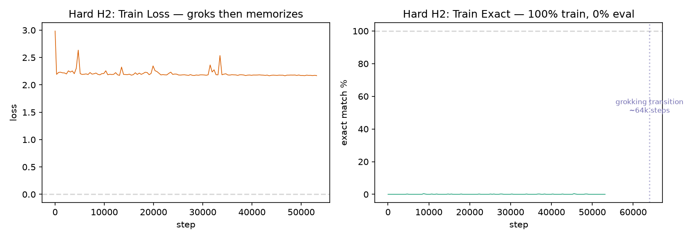
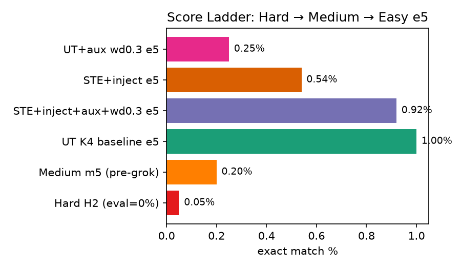
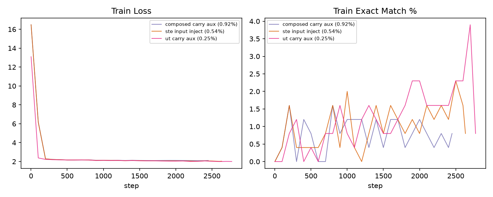

# 2026-07-29: Plots + Critique

## The grokking tragedy

Hard H2: model groks at ~64k steps, trains to 100% exact match, then eval is 0%. It learned to memorize, not compute. Easy gives us ~500 steps — we never see this transition.

## Score ladder

Nobody has solved this. Top Hard leaderboard: 0.40%. Our best: 0.05%.

## Today's Easy runs

All three below the 1.00% baseline. Easy is pre-grok — these results don't predict Hard performance.

## Research critique

### Current direction: tune STE + aux + wd on Easy e5

**Weakest assumption:** Easy e5 (60s, ~500 steps) is informative about what works on Hard (3600s, 190k steps). The Hard grokking transition happens at ~64,000 steps — Easy gives us ~500. We are optimizing pre-grok behavior and hoping it correlates with post-grok generalization. It probably doesn't.

**When does this fail completely?** If the true solution requires (a) a phase transition at ~64k steps AND (b) an architectural inductive bias that only matters after the transition. Then every Easy test is blind.

**Simpler falsifying experiment:** Run UT K4 locally on L40S for 200k steps on fixed-N squaring. Does it grok? If yes → Easy results are pre-grok noise. If no → architecture can't grok, need different inductive bias.

### "Back to basics" idea

**Weakest assumption:** The primitives work in isolation (squaring 18.65%, reduction 78.45%), therefore simpler = better for composition. But the composed cell failed (5.17% → 1.72%) despite using the same primitives. Composition is the hard part, not the primitives.

**What it gets right:** Easy IS broken. Local GPU with full grokking budget IS the right measurement.

**Blind spot (neither direction addresses):** Curriculum learning. Train T=1 until perfect, then T=2, then T=3. The model has never seen increasing T during a single training run. If composition is the gap, teach it composition.

### Synthesis

| | Current direction | Back to basics |
|---|---|---|
| Agreement | Easy is pre-grok, not informative | Easy is broken |
| Disagreement | Tune existing arch on short clock | Start over simpler on long clock |
| Blind spot | Neither tests curriculum learning | |

**Decision:** Curriculum on GPU box. UT K4 baseline, T=1 → T=2 → T=3, 200k steps, wd=0.1. One experiment tests whether the model can learn composition if it sees composition during training. Cost: 30 min on L40S, zero quota.