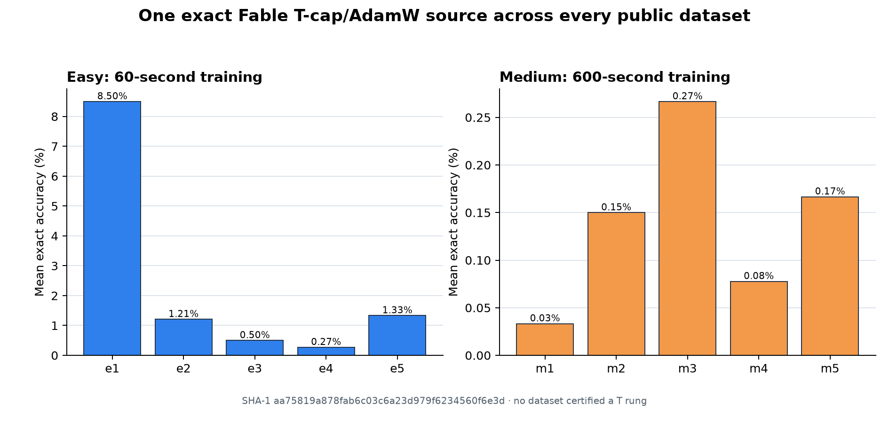

# Easy/Medium public-dataset completion suite

Status: complete; all six previously unsubmitted public datasets succeeded.

The owner explicitly authorized both competition submissions and continued
research. This suite fills the six public Easy/Medium datasets that have never
received one of our submissions: e2, e3, e4, m2, m3, and m4. It does not submit
Hard.

Every job uses the same validated Fable T-cap/AdamW source at exact SHA-1
`aa75819a878fab6c03c6a23d979f6234560f6e3d`. This source is selected because
it owns our strongest hosted results on both fixed-N e1 (8.50% mean) and
variable-N e5 (1.3333% mean). Holding source fixed makes dataset geometry the
only changed variable and turns the completion pass into a useful diagnostic.

Known anchors:

| Dataset | Mean exact | Job |
|---|---:|---|
| e1 | 8.5000% | `56335b5e-b460-4de2-a7d0-ed91fb9881fe` |
| e5 | 1.3333% | `f8deb7a5-ae86-46d6-9637-f307b141488f` |
| m1 | 0.0333% | `d71cad94-07ba-469f-8c7c-676e55d611a9` |
| m5 | 0.1667% | `60510147-ed5b-4944-97b5-ddce0340b883` |

The suite is descriptive, not a promotion gate: no candidate has solved T=1,
and no outcome here authorizes a Hard upload.

Accepted jobs:

| Dataset | Job | Status |
|---|---|---|
| e2 | `53966f7d-9216-4f55-af85-0210b2718baa` | 1.21% mean; no rung |
| e3 | `02896dd3-c8ba-4e92-9ba3-47fcfcb29def` | 0.50% mean; no rung |
| e4 | `ba0e96f0-6028-4722-b114-f0240700cc3d` | 0.27% mean; no rung |
| m2 | `90255ac4-d43f-44de-a694-77d63c04df45` | 0.15% mean; no rung |
| m3 | `0749801d-b5a9-40ea-9c7d-ae3fb05204a2` | 0.27% mean; no rung |
| m4 | `29c24b00-a57c-43c7-b3b1-451ece84257d` | 0.0778% mean; no rung |

The service permitted only one active submission per participant, so all six
jobs were executed serially. Structured metrics are preserved under ignored
`runs/hosted_metrics/`; exact hosted scores and job identities are frozen in
[`results.json`](results.json).

## Interpretation

- e1's 8.50% does not represent a general fixed-N skill: changing only to e2
  drops mean exact to 1.21%.
- Holding T=2 does not solve variable-modulus arithmetic: e3 reaches 0.50% and
  larger-N e4 falls to 0.27%.
- Ten times more training does not expose an algorithmic transition. Medium
  m3 completes 19,424 updates yet reaches only 0.27%, while fixed-N m2 reaches
  0.15% and large-N/T=8 m4 reaches 0.0778%.
- No public dataset certifies a T rung. Together with the T=1 diagnostics,
  this localizes the primary failure inside transferable one-step modular
  arithmetic rather than recurrence-depth optimization.
