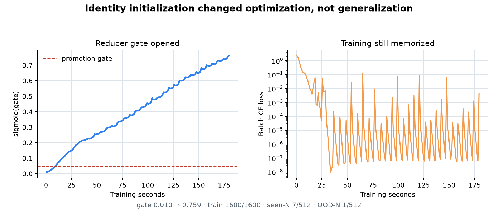

# Identity-initialized residual reducer

Status: refuted at the selected seed-0 gate; no additional seeds run.

The owner selected Option A after the interface-noise refutation. Relative to
the deterministic public-E5 factored anchor, the data, square phase, reducer
cell, decoder, optimizer, seed, final-label-only loss, and 180-second clock are
fixed. The sole mechanism change is the reduction update:

```text
h <- h + sigmoid(a) * (GRU_reduce(h, N) - h)
```

The one learned scalar starts at `sigmoid(a)=0.01`, so reduction initially
preserves 99% of the square state. This provides a gradient highway before the
random reducer learns useful behavior; the gate can open during training. No
intermediate arithmetic label is supplied.

Promotion requires at least 95% train exact, 5% seen-N T=1, 2% OOD-N T=1,
and a final reduction gate above 0.05. Kill if train exact is below 95% or
OOD-N remains at or below 1%. More seeds run only after every promotion gate.

Remote run root:
`/home/ubuntu/somn-taskb/runs/t1_factored_e5_identity_reducer/seed0`.

No checkpoint from this diagnostic may be loaded into a competition
submission.

## Result

The L40 completed 17,366 updates in 180.01 seconds (96.47 updates/s). The
single reduction gate opened from 0.01 to 0.7592:

| Profile | Exact | Token accuracy |
|---|---:|---:|
| Training rows | 1,600/1,600 (100%) | 100% |
| Public seen-N T=1 | 7/512 (1.3672%) | 32.2754% |
| Public OOD-N T=1 | 1/512 (0.1953%) | 14.2090% |

The final seen-N and OOD-N exact counts are identical to the deterministic
public-support anchor despite a substantially different optimization path.
The OOD kill threshold fired, so seeds 1 and 2 are not authorized.



## Interpretation

The reducer was not trapped near identity: it opened smoothly past the 0.05
mechanism gate in about ten seconds and reached 0.759. A clean gradient highway
also did not prevent exact memorization. Since the run converged to the same
held-out counts as the random-update anchor, reducer initialization and early
credit blockage are not the primary cause. The remaining high-value branch is
an actually capable sublinear reduction mechanism, not another optimizer,
gate-initialization, noise, support, or topology sweep.

The incremental GPU backup verified 20 files and 206,109 bytes at the local
artifact root for Prime pod `0c1aba701be94af3bb8494f88e962a53`.
