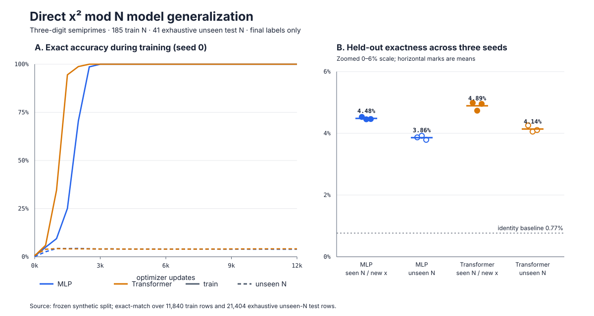

# Direct-model comparison: what controls learnability?

Status: completed synthesis of six preregistered runs.

The direct 2.19M MLP and 1.79M standard Transformer used the same 185/39/41
semiprime-N split, 64 final-label examples per train N, AdamW, 12,000 updates,
and three seeds. Both achieved 100% train exact in every seed. MLP unseen-N
exact was 3.79%--3.92%; Transformer was 4.06%--4.26%.

The learning curves are stronger evidence than the endpoints: held-out
exactness stays near 4% while held-out cross-entropy rises above 11 as training
exactness reaches 100%. Optimization is working, but it reliably selects a
memorizing function. Generic attention adds a small statistical advantage and
does not change that selection.

The 4% level is meaningful partial correlation, not a constant-output artifact:
on the same exhaustive unseen-N rows, identity `y=x` is 0.77%, constant zero is
0.19%, and an optimistic test-label digit-mode vector is 0.23% exact. It is
still nowhere near a usable algorithm because about 96% of outputs are wrong.

For this task, the present evidence ranks learnability controls as:

1. **Supervision and identifiability:** intermediate arithmetic traces changed
   unseen-N T=1 from about 4% to 95.79% in the small diagnostic.
2. **Data support across N and x:** sparse samples permit a cheaper collection
   of modulus-specific maps; more rows help only if they constrain a shared
   rule rather than enlarge the lookup table.
3. **Architectural locality/state:** necessary for scalable arithmetic, but
   MLP versus ordinary attention did not change the learned mechanism.
4. **Objective and curriculum:** exact digit loss rewards memorization equally;
   held-out-N selection or trace/consistency objectives are needed to prefer
   the reusable rule.
5. **Optimizer and seed:** AdamW fits both models reliably, and six seeds show
   negligible qualitative variation. More optimization strengthens the wrong
   solution rather than discovering arithmetic.

Evidence is preserved in the two direct-model artifact directories under
`diagnostics/artifacts/prime-a6eb7c97e54d4174a9b265674758a383/runs/`.
