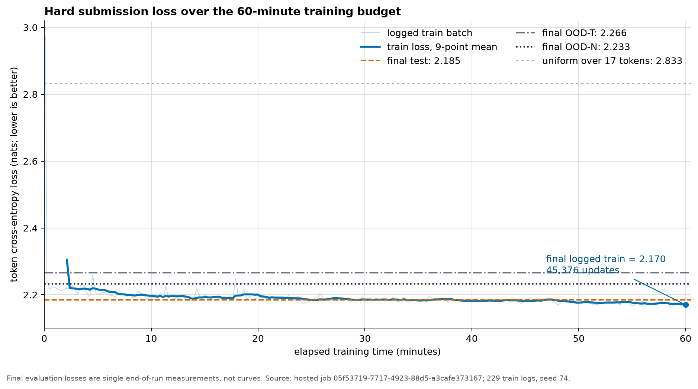

# Submission selection refresh

## Answer first

The exact canonical register lost its previously nonzero public OOD-N T=1
signal on a third hosted Easy e5 replication. The exact Fable T-cap/AdamW
source reproduced its chance-scale Medium m5 score but again had zero T=1 on
both profiles. Neither source learned the operator. For the owner's scheduled
forced Hard attempt, Fable remains selected only because its family owns the
best historical hosted Hard mean and the strongest direct Easy/Medium scores.

## Exact-source evidence

| Source | Job | Tier | Mean | Seen-N T=1 | OOD-N T=1 | Decision |
|---|---|---|---:|---:|---:|---|
| Canonical `5b622f0` | `cfb0fc73` | Easy e5 | 0.5000% | 2/512 | 0/512 | dual-profile repeat refuted |
| Fable `aa75819` | `233cbce0` | Medium m5 | 0.1556% | 0/768 | 0/768 | chance baseline confirmed |

Canonical completed 1,569 updates. Fable completed 13,672 updates and scored
13/9,000 test plus 5/3,000 OOD. Neither certified a rung. Exact hosted details
come from `one-layer status <job> --json`; the prediction and outcome are in
[`../predictions.md`](../predictions.md).

## Hard selection

Selected file: [`../../submissions/fable_tcap_adamw/submission.py`](../../submissions/fable_tcap_adamw/submission.py)

- SHA-1: `aa75819a878fab6c03c6a23d979f6234560f6e3d`
- Size: 9,071 bytes
- Validation: `one-layer validate` passed on 2026-08-11.
- Static audit: no task-value modulo, `pow`, `sympy`, `gmpy`, `torch.load`, or
  custom backward; AdamW owns `model.parameters()` and model-state assertion is
  present.
- Expected result: 0.02%--0.08%, no rung, 0/768 on both T=1 profiles.

This is quota execution, not scientific promotion. The next research session
must return to legal unseen-N T=1 identifiability rather than tune this source.

## Submission

At 00:45 WAT, after confirming no active job and rechecking validation and
SHA-1, the service accepted Hard job
`05f53719-7717-4923-88d5-a3cafe373167`. It reported zero Hard attempts left
for the UTC day. The source was not changed after the Easy/Medium refresh.

## Hard result and loss interpretation

The job scored **0.0300%**, certified no rung, and produced 0/768 on both
seen-N and OOD-N T=1. It completed 45,376 updates with final train loss
2.16981. Final evaluation losses were 2.18534 test, 2.26573 OOD-T, and 2.23299
OOD-N.

The evaluator exposes 229 logged training batches but only one final loss per
evaluation split, so the horizontal evaluation references are not validation
curves. Loss improved substantially over uniform prediction across the model's
17-token vocabulary (`ln(17)=2.83321`): final test perplexity was 8.89 rather
than 17. This is real token-level predictive structure. It is not practically
significant for the competition objective: exact accuracy remained 0.0300%,
both T=1 profiles were zero, and training had plateaued near 2.18 for most of
the hour. With one hosted seed and no per-example loss variance, a formal
confidence interval for the loss difference is unavailable.
