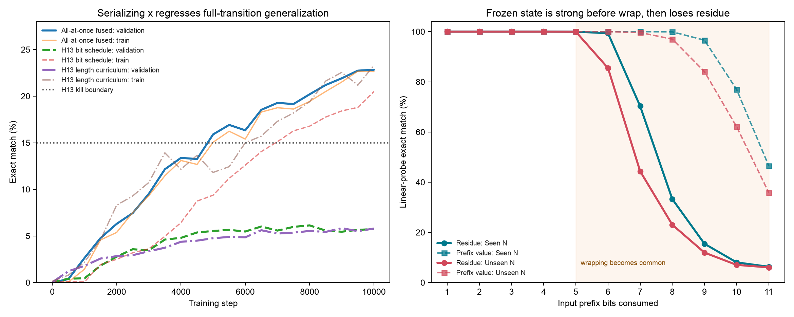

# H13 bit-serial prefix residue

## Question

Can changing only the order in which `x` is revealed make legal final modular
labels identify a reusable transition? The all-at-once reference sees every
`x` bit throughout 44 tied ConvGRU updates. H13 keeps width 256, the same cell,
44 total updates, 9% recurrent dropout, tuned Muon, data split, seed, batch,
and final residue BCE, but reveals one `x` bit from MSB to LSB every four
updates. It receives no square, carry, quotient, comparison, subtraction, or
intermediate residue labels.

## Full-transition result

| Model | Train | Unseen `x`, seen `N` | Seen `x`, unseen `N` | Joint unseen |
|---|---:|---:|---:|---:|
| All-at-once fused reference | 22.09% | **22.84%** | **18.38%** | **22.50%** |
| H13 scheduled `x` | 16.88% | **6.14%** | **4.76%** | **5.58%** |

Validation selected H13 step 8,000. At step 10,000 its 5,000-row train probe
reached 20.50% while validation fell to 5.74%. The preregistered validation
kill was 15%, so this exact schedule is rejected. Serial input alone does not
prevent the 1.77M-parameter latent state from fitting training combinations
without learning the reusable full transition.

## Frozen per-prefix state probe

The rejected model still offers a useful localization test. With the processor
frozen, independent global linear heads read its work and scratch lanes after
each input bit. Heads predict the corresponding prefix residue or the prefix
value. These privileged diagnostic labels never updated H13 and never selected
its checkpoint.

| Prefix bits | Residue seen `N` | Residue unseen `N` | Value seen `N` | Value unseen `N` |
|---:|---:|---:|---:|---:|
| 5 | 99.98% | 99.98% | 100.00% | 100.00% |
| 6 | 99.38% | 85.50% | 100.00% | 100.00% |
| 7 | 70.32% | 44.38% | 100.00% | 99.64% |
| 8 | 33.28% | 23.06% | 99.92% | 97.02% |
| 9 | 15.48% | 11.96% | 96.62% | 84.08% |
| 11 | 6.32% | 6.06% | 46.50% | 35.88% |

The state preserves the consumed prefix much longer than it preserves the
residue. Residue transfer begins breaking between six and seven bits, when
square values commonly require reduction for 10--11-bit moduli. Unseen `N`
degrades first. This localizes the immediate problem to maintaining a
modulus-dependent state after wrapping begins, not merely reading or retaining
incoming `x` bits.

The near-perfect short-prefix probes are not proof of an algorithm: there are
few possible short prefixes, and the probes receive privileged targets. They
are evidence that the architecture has a learnable short regime and a sharp
frontier, which licensed one final-label-only length curriculum.

## Significant-bit curriculum result

The curriculum consumed only prompt-visible significant bits and progressively
admitted provided rows of lengths 4 through 11. It computed no auxiliary
labels. Validation selected step 9,000:

| Model | Train | Unseen `x`, seen `N` | Seen `x`, unseen `N` | Joint unseen |
|---|---:|---:|---:|---:|
| All-at-once fused reference | 22.09% | **22.84%** | **18.38%** | **22.50%** |
| H13 length curriculum | 22.56% | **5.84%** | **3.82%** | **4.32%** |

The preregistered below-10% kill fires. The curriculum recovered train fit but
not transfer: at 11-bit `x`, selected exact match was 1.64% on train, 0.47% on
validation, 0.28% on seen-`x`/unseen-`N`, and 0.09% on joint unseen. Easy
short-prefix labels therefore reinforced a length-specific path without
teaching the wrap operation needed at full length. Reject this curriculum and
do not combine it with the submitted throughput model.

## Evidence

- [`config.json`](config.json), [`train.py`](train.py),
  [`eval_report.json`](eval_report.json), [`run.log`](run.log)
- [`probe_config.json`](probe_config.json),
  [`probe_prefix_states.py`](probe_prefix_states.py),
  [`probe_report.json`](probe_report.json), [`probe_run.log`](probe_run.log)
- [`curriculum_config.json`](curriculum_config.json),
  [`train_curriculum.py`](train_curriculum.py),
  [`curriculum_eval_report.json`](curriculum_eval_report.json),
  [`curriculum_run.log`](curriculum_run.log)
- Byte-count verified ignored backups under
  `diagnostics/artifacts/prime-7072f85e48094888bcf3893db897ea54/`
