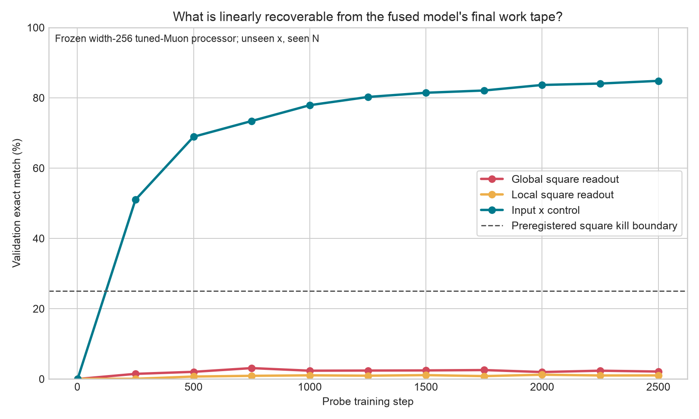

# Frozen square representation probe

## Question

Does the branch-best fused width-256 tuned-Muon model solve modular squaring by
first constructing a literal 22-bit square in its final work tape?

The processor checkpoint is frozen. Three linear heads are trained from its
final lane-2 state: a position-shared local square head, an unrestricted global
square head, and an 11-bit source-`x` control. The heads cannot change the
processor or its residue prediction. Each head is selected independently by
its own unseen-`x`, seen-`N` validation exact match; the two unseen-`N` audits
are opened once afterward.

## Result

| Readout | Train | Validation | Seen `x`, unseen `N` | Joint unseen |
|---|---:|---:|---:|---:|
| Local literal square | 0.75% | 1.22% | 0.58% | 0.84% |
| Global literal square | 4.09% | **3.10%** | 3.40% | **3.02%** |
| Source `x` control | 91.10% | **84.82%** | 81.70% | **78.50%** |

The preregistered square kill boundary was 25%; the global square result is
3.10%. The positive `x` control shows that the probe and hidden representation
are not generally unreadable. The model's own final modular-residue validation
exact is 22.84%, far above the literal-square readout.

## Interpretation

The final work tape preserves the input but does not expose a linearly explicit
literal square. Therefore the 22.84% residue improvement is not good evidence
for the intended `square, then reduce` mechanism, and more width or optimizer
tuning of this same all-at-once fused architecture is no longer the main line.

This is correlational. It does **not** exclude a nonlinear square code, a square
that exists only at an earlier recurrent step, or a direct residue algorithm.
Those possibilities would require nonlinear or time-resolved interventions.
The highest-value next card changes computation order: H13 schedules one `x`
bit at a time while retaining final-label-only training.

An initial implementation pass incorrectly restored all heads at the global
square head's best step. It was invalidated before interpretation. The clean
rerun independently selected local square at step 2,000, global square at 750,
and `x` at 2,500. Both passes remain in the ignored verified GPU backup.

## Evidence

- [`config.json`](config.json)
- [`probe.py`](probe.py)
- [`report.json`](report.json)
- [`run.log`](run.log)
- Ignored verified backup:
  `diagnostics/artifacts/prime-7072f85e48094888bcf3893db897ea54/fused-width256-square-probe-2026-08-17/`
