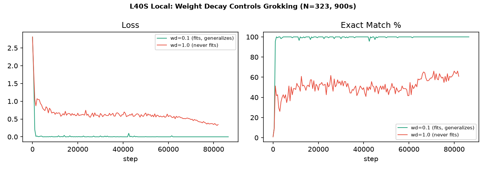
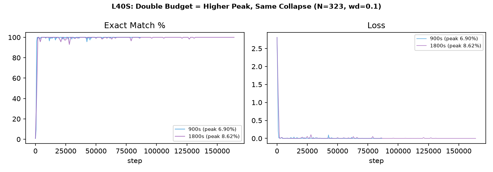
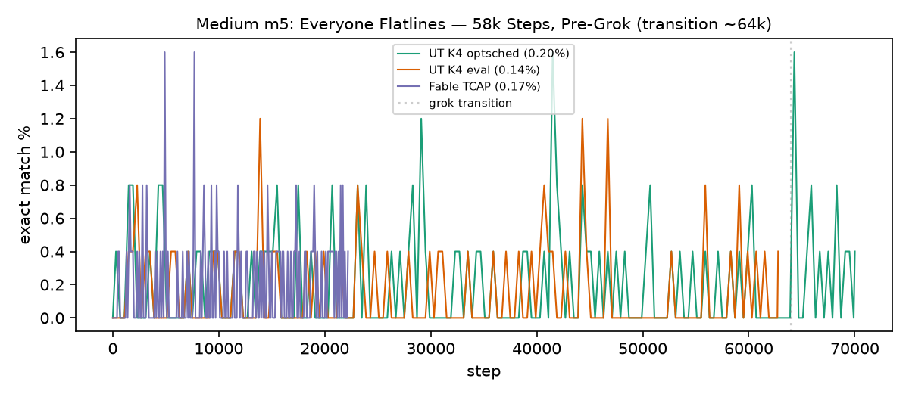

# GPU Analysis

## Weight Decay on L40S

wd=0.1 fits immediately. wd=1.0 never fits.

## Budget Scaling

Double time = higher peak, same collapse.

## Medium Pre-Grok

All architectures flatline before the grokking transition.
